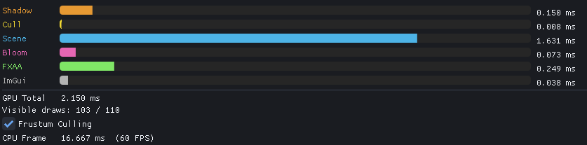
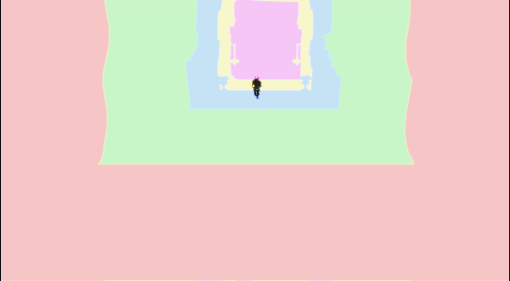
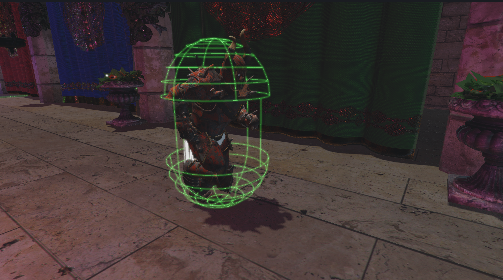

# Novus Engine

Novus Engine is a game engine built from the ground up using the Vulkan graphics API. It is designed to be a high-performance, cross-platform engine for creating games and interactive applications.

**Stack:** C++20 · Vulkan 1.4 (RAII hpp) · Slang shaders → SPIR-V · entt ECS · Jolt Physics · Assimp · ImGui · GLM

## Features

### Renderer
- **GPU-driven indirect rendering** — static scene geometry merged into a single global vertex/index buffer; one `vkCmdDrawIndexedIndirectCount` call per frame after GPU frustum culling
- **GPU frustum culling** — compute shader (Gribb-Hartmann planes, 64-thread workgroups, `atomicAdd` compaction); GPU timestamp readback shows cull pass cost; live toggle lets you compare culled vs. unculed draw counts
- **Physically-based rendering (PBR)** — metallic/roughness workflow, image-based lighting (IBL) via irradiance cubemap + prefiltered environment map + BRDF LUT; works on both static indirect and skinned Assimp paths
- **Cascaded shadow maps** — 5-cascade CSM with configurable lambda, padding, depth bias, and cascade blend; F3 hotkey toggles cascade debug visualisation
- **Skeletal animation** — GPU skinning via Slang compute shader; bone matrices uploaded per frame; blended animation clips
- **Post-processing** — bloom (extract + Gaussian blur passes), FXAA, configurable exposure/gamma
- **GPU profiling** — per-pass timestamp queries (Shadow, Cull, Scene, Bloom, FXAA, ImGui) displayed as colour-coded progress bars; always-on viewport overlay shows FPS, GPU ms, and visible draw count

### Editor
- **ImGui-based scene editor** — entity hierarchy, component inspector, transform gizmos (ImGuizmo), play/edit mode toggle
- **IBL loader** — browse for a KTX2/KTX directory or select files individually; supports both KTX-Software and a direct fallback reader for non-compliant bakers
- **Render preset I/O** — save and load shadow + post-processing settings as JSON presets
- **Physics debug** — collider wireframe overlay with Jolt Physics

### Architecture
- **entt ECS** — components for transform, camera, light, renderable, animation, physics, player controller, hierarchy
- **Scene serialization** — full scene save/load
- **Gameplay layer** — fixed-timestep update loop, gameplay runtime decoupled from the renderer

## Demo Examples

**Figure 1:** A sample scene showcasing the engine's capabilities, including PBR materials, dynamic lighting, and post-processing effects.

**Figure 2:** GPU timings overlay displaying per-pass performance metrics.

**Figure 3:** Cascaded shadow map debug visualization showing cascade splits and frustum intersections.

**Figure 4:** Physics debug draw mode visualizing collider shapes and interactions.

**Figure 5:** ImGui-based scene editor showcasing entity hierarchy, component inspector, and transform gizmos.